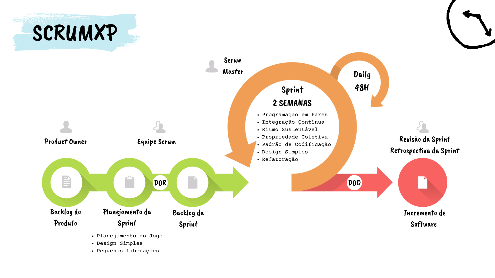

# Processo de desenvolvimento de software
Nossa metodologia de desenvolvimento é simples, vão ser utilizadas técnicas do XP e Scrum.

## Práticas do Scrum que serão aplicadas

- **Daily Scrum**: Reuniões diárias para discussão de possíveis desafios e soluções apresentados pelos membros.
- **Sprint Planning**: Reunião realizada no inicio de cada sprint, para definir os itens do backlog que serão desenvolvidos na sprint.
- **Sprint Restrospective**: Reunião realizada com objetivo de refletir sobre o que foi feito na sprint passada e então  identificar maneira de melhorar sprints futuras.
- **Sprint Review**: Reunião para revisar todos os itens do backlog que foram concluídos de acordo com as definitions of ready and done, com participação de clientes.
- **Product Backlog**:  Lista de histórias priorizadas que precisam ser desenvolvidos para atender aos objetivos do projeto.

## Práticas do XP que serão aplicadas

### No nível de programação

- **Programação em Pares:** Toda produção de código é feita por dois programadores, lado a lado. Essa prática garante que o código de produção seja revisado por pelo menos um outro programador e acaba resultando com melhor qualidade.
- **Refatoração:** A refatoração será importante para ajudar a manter o código limpo e de fácil manutenção. Para isso, estaremos sempre que possível fazendo pequenas melhorias técnicas no código, diminuindo o número de "gambiarras" e soluções provisórias pelo código, assim seremos capazes de reduzir o tempo necessário para corrigir problemas.
- **Design Simples:** Com o design simples queremos garantir que o código seja fácil de entender e manter. Ao evitar a criação de soluções mais complicadas que o necessário, esperamos reduzir o tempo de correção de problemas e agregar valor à aplicação.
- **Padrão de Codificação:** Ao definir um padrão de codificação queremos garantir que o código seja legível, consistente e compreensível por toda a equipe. Assim, ao saber dos padrões do projeto também conseguiremos facilitar algumas práticas do nível de equipe.

### No nível de equipe

- **Propriedade Coletiva:** Devido à diferença no nível dos nossos conhecimentos específicos e gerais, a propriedade coletiva pode promover o aprendizado e crescimento dos membros da equipe, já que ela incentiva a colaboração e o compartilhamento de conhecimento. Assim, esperamos evitar a sobrecarga de um ou mais membros, além de fazer a equipe trabalhar de forma mais eficiente e eficaz.

### No nível de processo

- **Ritmo Sustentável:** Com o ritmo sustentável, esperamos manter a produtividade e a qualidade do trabalho da equipe. Para isso vamos evitar deixar coisas para a última hora, mantendo um ritmo constante de pequenos progressos, assim esperamos evitar o desgaste e a fadiga dos membros da equipe.
- **Integração Contínua:** Ao integrar o trabalho da equipe frequentemente, a integração contínua irá nos ajudar a evitar problemas de integração no final de cada iteração. Com isso esperamos garantir uma aplicação final estável e que funcione corretamente.
- **Pequenas Liberações:** Devido ao contato próximo ao cliente e a própria natureza do Scrum essa prática permitirá que a equipe receba feedback com frequência evitando o retrabalho desnecessário.
- **Planejamento do Jogo:** Com o planejamento do jogo esperamos ser capazes de estimar o esforço necessário para concluir cada item do backlog do produto, ajudando na sua priorização. E além de auxiliar no planejamento de uma iteração, pode ser uma dinâmica interessante para promover a integração da equipe.

## Práticas do XP que não serão aplicadas

- **Desenvolvimento Dirigido por Testes:** Consideramos essa prática complexa demais se comparado aos seus benefícios, também levamos em conta que ninguém tem uma experiência prévia com TDD, muito provável que passaríamos mais tempo criando testes do que desenvolvendo do próprio código.
- **Testes de Cliente:** Devido à falta de tempo e recursos do cliente para escrever testes para cada história, não será possível aplicar essa prática no projeto.
- **Metáfora:** Acreditamos que a criação de uma metáfora pode ser difícil, especialmente considerando que a aplicação não se encaixa bem em uma metáfora. Também consideramos que o cliente escolhido também é um dev, logo a metáfora deixa de ser tão necessária na relação Equipe Scrum e PO.
- **Toda a Equipe:** Devido a dificuldades de horários, não será possível implementar a prática de toda a equipe. No entanto, vamos buscar formas de colaboração e integração em níveis menores, garantindo que todos possam contribuir para o sucesso do projeto.

## Histórico de revisão

|   Data   | Versão | Descrição                                        | Autor           |
| :------: | :----: | ------------------------------------------------ | --------------- |
| 19/04/23 |  1.0   | Criação da documentação                          | Todos           |
| 01/05/23 |  1.1   | Adicionando práticas do Scrum e Diagrama ScrumXP | Ricardo e Pedro |